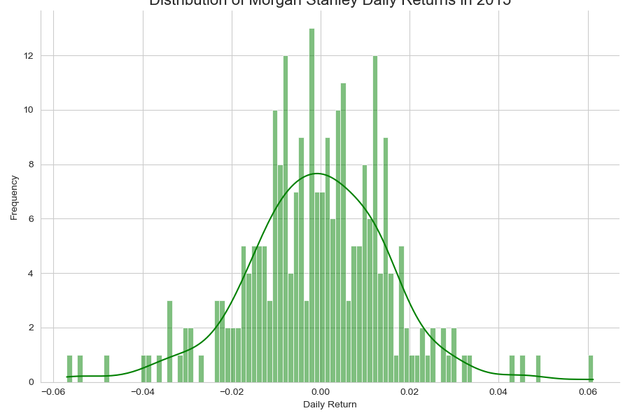
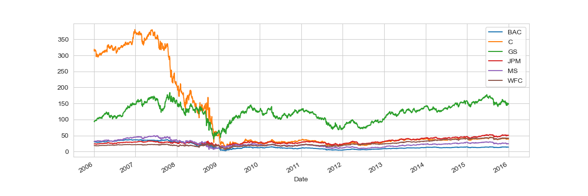
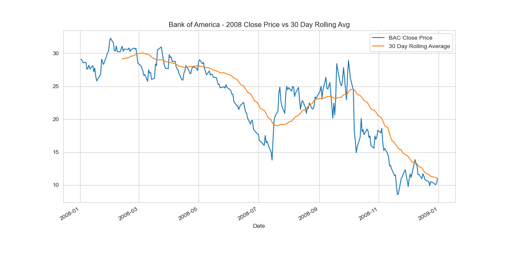
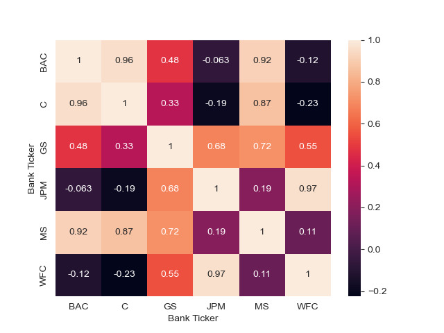

# 💹 Bank Stocks Analysis

## 📌 Introduction
Ever wondered how major U.S. banks performed during and after the financial crisis? 💭  
This project explores **historical stock data (2006–2016)** for major banks — including **JPMorgan, Goldman Sachs, Bank of America, Morgan Stanley, Citigroup, and Wells Fargo** — using **Python**, **Pandas**, and **Seaborn**.  

Through data analysis and visualization, the notebook highlights **stock performance trends**, **volatility**, and **correlations** between the banks across time.

---

## 🎯 Objectives
- Analyze **time series trends** of major U.S. banks.  
- Visualize **closing prices** and **daily returns**.  
- Compare **volatility and risk** across different banks.  
- Explore **correlations** to understand market behavior during financial shifts.

---

## 🛠 Tools & Libraries
- **Python** – data analysis and programming  
- **Pandas / pandas-datareader** – data manipulation and fetching stock data  
- **Matplotlib / Seaborn** – visualization and charting  
- **Jupyter Notebook** – interactive environment for EDA  

---

## 💡 Insights
- Clear **price declines** observed during the 2008 financial crisis 📉  
- Some banks demonstrated **faster recovery and stronger performance** after 2012  
- Correlation heatmaps reveal strong relationships between **market-leading banks**  
- Moving averages highlight **long-term growth vs. short-term volatility**

---

## 📈 Visualizations  

### 1️⃣ Daily Returns Distribution  

  

---

### 2️⃣ Bank Closing Prices (2006–2016)  

  

---

### 3️⃣ Moving Average Trends  

  

---

### 4️⃣ Correlation Heatmap  

  

---

## ✅ Conclusion
This project demonstrates how **Exploratory Data Analysis (EDA)** techniques can uncover valuable insights about financial markets — helping visualize trends, volatility, and overall market stability using real data.

---

📅 *Time period analyzed:* 2006 – 2016  
📂 *Data source:* Yahoo Finance via `pandas-datareader`
